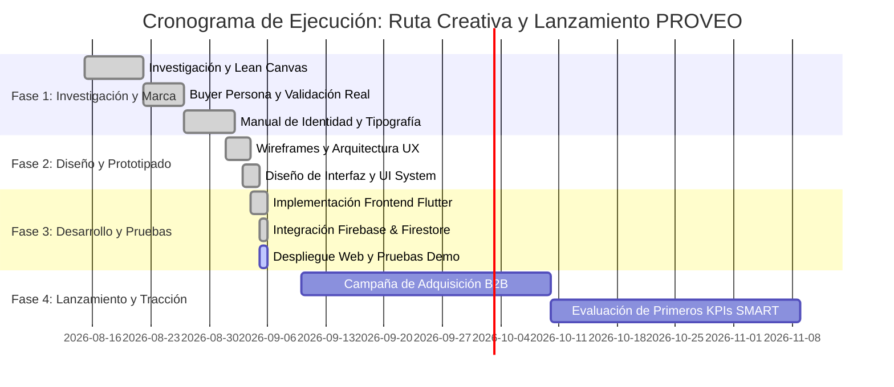

# 📈 Plan de Marketing Oficial — PROVEO Nicaragua
> **Entregables Oficiales de Marketing — Categoría Aficionado (Hackathon Nicaragua 2026)**

---

## 📌 Índice
1. [Metodología Lean Canvas (9 Bloques)](#1-metodología-lean-canvas-9-bloques)
2. [Buyer Persona y Campos de Aspiraciones](#2-buyer-persona-y-campos-de-aspiraciones)
3. [Plan de Branding: Misión, Visión, Concepto y Arquetipo](#3-plan-de-branding-misión-visión-concepto-y-arquetipo)
4. [Propuesta de Valor y Estrategia de Canales](#4-propuesta-de-valor-y-estrategia-de-canales)
5. [Objetivos SMART y Cronograma de Tiempos de Entrega](#5-objetivos-smart-y-cronograma-de-tiempos-de-entrega)

---

## 1. Metodología Lean Canvas (9 Bloques)

Aterrizado a partir de la investigación en campo con emprendedores y MIPYMES de Managua, Masaya y León:

| # | Bloque Lean Canvas | Definición para PROVEO Nicaragua |
| :-: | :--- | :--- |
| **1** | **Problema** | • Informalidad, dispersión y falta de información confiable sobre proveedores en Nicaragua. • Procesos de cotización lentos por WhatsApp y Facebook que toman días. • Riesgo de estafas, entregas tardías y falta de garantías de calidad. |
| **2** | **Segmentos de Clientes** | • **Compradores:** Emprendedores, pequeñas y medianas empresas (MIPYMES) comerciales, agroindustriales y de servicios. • **Proveedores:** Empresas nicaragüenses formalizadas o con capacidad de producción al mayoreo que buscan nuevos clientes B2B. |
| **3** | **Propuesta de Valor Única** | *"El puente inteligente que conecta emprendedores y empresas con los mejores proveedores verificados mediante IA y comparación transparente."* |
| **4** | **Solución** | • Buscador especializado con filtros por departamento, rubro y calificación. • Asistente **PROVEO Match** con recomendaciones asistidas por IA. • Generador de cotizaciones estandarizadas y matriz comparativa lado a lado. |
| **5** | **Canales** | • Plataforma Web Progresiva (PWA) accesible desde móviles y PC. • Alianzas con cámaras de comercio, ferias de emprendimiento y centros tecnológicos. • Canales digitales (LinkedIn B2B, Instagram, WhatsApp Business API). |
| **6** | **Estructura de Costes** | • Infraestructura en la nube (Google Cloud / Firebase Hosting / Firestore). • Consumo de APIs de Inteligencia Artificial (Gemini API). • Mantenimiento técnico, seguridad, verificación de proveedores y marketing. |
| **7** | **Flujos de Ingresos** | • Membresías freemium y planes destacados para proveedores ("Círculo Dorado"). • Comisión fija por cotizaciones formales cerradas o leads calificados B2B. • Servicios de publicidad corporativa destacada y analítica avanzada de mercado. |
| **8** | **Métricas Clave (KPIs)** | • Número de proveedores verificados activos en catálogo. • Tiempo promedio de respuesta a cotizaciones (< 2 horas). • Tasa de conversión de solicitudes a tratos cerrados (> 35%). |
| **9** | **Ventaja Especial (Injusta)** | Red de verificación de confianza local geolocalizada + comparador algorítmico multicriterio adaptado al contexto socioeconómico de Nicaragua. |

---

## 2. Buyer Persona y Campos de Aspiraciones

### Perfil Principal: Carlos Gómez — El Emprendedor en Expansión

- **Edad:** 32 años.
- **Ubicación:** Managua, Nicaragua.
- **Ocupación:** Fundador y Gerente de Operaciones de *"EcoPack Nicaragua"* (Emprendimiento de cosmética natural y empaques biodegradables).
- **Nivel Educativo:** Licenciatura en Administración de Empresas.
- **Comportamiento Digital:** Usa smartphone 8+ horas al día, navega activamente en WhatsApp Business, Instagram, LinkedIn y banca en línea. Busca soluciones ágiles sin burocracia.

#### Necesidades:
1. Encontrar proveedores confiables de frascos de vidrio, etiquetas y materias primas con stock local inmediato.
2. Obtener precios al por mayor con Cantidades Mínimas de Pedido (MOQ) realistas para pequeños negocios.
3. Certeza en los tiempos de entrega para no detener su línea de producción.

#### Frustraciones Actuales:
- Perder hasta 4 días esperando que proveedores informales le envíen una cotización por chat.
- Precios arbitrarios que cambian constantemente sin justificación.
- Recibir pedidos defectuosos o sin factura formal que impiden su deducción contable.

#### Campos de Aspiraciones:
- **Aspiración Operativa:** Automatizar y centralizar el 100% de sus compras de insumos en un solo lugar confiable.
- **Aspiración de Crecimiento:** Escalar su capacidad productiva para abastecer a supermercados y cadenas departamentales de Nicaragua.
- **Aspiración de Reputación:** Ser reconocido como una marca formal, puntual y sostenible en el mercado nacional.

---

## 3. Plan de Branding: Misión, Visión, Concepto y Arquetipo

### Misión
Democratizar y profesionalizar el abastecimiento empresarial en Nicaragua, conectando a emprendedores con proveedores verificados mediante tecnología inteligente que fomente la transparencia, la competitividad y el crecimiento mutuo.

### Visión
Convertirse en la plataforma B2B referente de Centroamérica para el encadenamiento productivo inteligente, impulsando a más de 10,000 MIPYMES al comercio formal y digital para el año 2028.

### Concepto Central de Marca
> **"Conectamos confianza. Impulsamos negocios."**
PROVEO no vende productos: construye un ecosistema donde la reputación comprobada y los datos transparentes sustituyen la incertidumbre en las compras empresariales.

### Arquetipo de Marca: El Sabio + El Creador Protector
- **El Sabio (60%):** Brinda datos objetivos, análisis comparativo y recomendaciones inteligentes para que el emprendedor tome la mejor decisión con certeza.
- **El Creador Protector (40%):** Diseña puentes seguros, valida proveedores y acompaña a las MIPYMES a construir negocios sólidos.
- **Tono de Voz:** Profesional, claro, empático, seguro y propositivo.

---

## 4. Propuesta de Valor y Estrategia de Canales

### Propuesta de Valor Diferenciada
| Elemento Tradicional | Con PROVEO Nicaragua |
| :--- | :--- |
| Búsqueda dispersa en Facebook / WhatsApp | Catálogo estructurado y centralizado con MOQ y precios |
| Cotizaciones individuales en formatos desordenados | Matriz comparativa simultánea (Precio vs. Tiempo vs. Reputación) |
| Proveedores sin respaldo | Distintivo de Proveedor Verificado con geolocalización |
| Elección a ciegas | Recomendaciones objetivas asistidas por IA |

### Estrategia de Canales de Adquisición y Distribución
1. **Canal Directo Digital (PWA):** Aplicación web accesible desde cualquier dispositivo sin fricción de descarga obligatoria.
2. **Estrategia Inbound B2B:** Contenido educativo sobre compras estratégicas, reducción de costos de insumos y formalización para emprendedores en redes sociales.
3. **Alianzas Estratégicas Institucionales:** Acuerdos con centros de innovación, cámaras empresariales e institutos técnicos para certificar y registrar proveedores locales.
4. **Activación B2B Outbound:** Programa de reclutamiento de empresas industriales líderes en rubros clave (empaque, confección, alimentos y tecnología).

---

## 5. Objetivos SMART y Cronograma de Tiempos de Entrega

### Objetivos SMART

1. **Objetivo de Adquisición de Proveedores:**
   - *Específico:* Afiliar y verificar a 50 empresas proveedoras de insumos clave en los departamentos de Managua, Masaya y León.
   - *Medible:* 50 perfiles con catálogo activo y ficha completa en la plataforma.
   - *Alcanzable:* Mediante visitas directas y alianzas gremiales.
   - *Relevante:* Garantiza masa crítica de opciones en el catálogo de lanzamiento.
   - *Tiempo:* 60 días naturales tras el despliegue de la versión 1.0.

2. **Objetivo de Tracción de Cotizaciones:**
   - *Específico:* Facilitar la emisión de al menos 300 solicitudes de cotización formales a través del asistente PROVEO Match.
   - *Medible:* Registro de 300 registros en la colección `quotations` de Firestore.
   - *Alcanzable:* Impulsado por la campaña digital hacia emprendedores del ecosistema.
   - *Relevante:* Valida el uso del comparador y el valor del matching inteligente.
   - *Tiempo:* Primeros 90 días de operación pública.

3. **Objetivo de Tiempo de Respuesta y Satisfacción:**
   - *Específico:* Mantener un tiempo de respuesta comercial promedio inferior a 4 horas en el 85% de las solicitudes, con una calificación de satisfacción de usuario no menor a 4.6/5.0.
   - *Medible:* Telemetría de chat y encuestas de evaluación post-cotización.
   - *Alcanzable:* Gracias a las notificaciones instantáneas de la plataforma.
   - *Relevante:* Construye la confianza como activo central de la marca.
   - *Tiempo:* Monitoreo continuo mensual durante el primer semestre.

---

### Cronograma de Ruta Creativa y Tiempos de Entrega

---

© 2026 PROVEO Nicaragua — Documentación Estratégica de Marketing.
