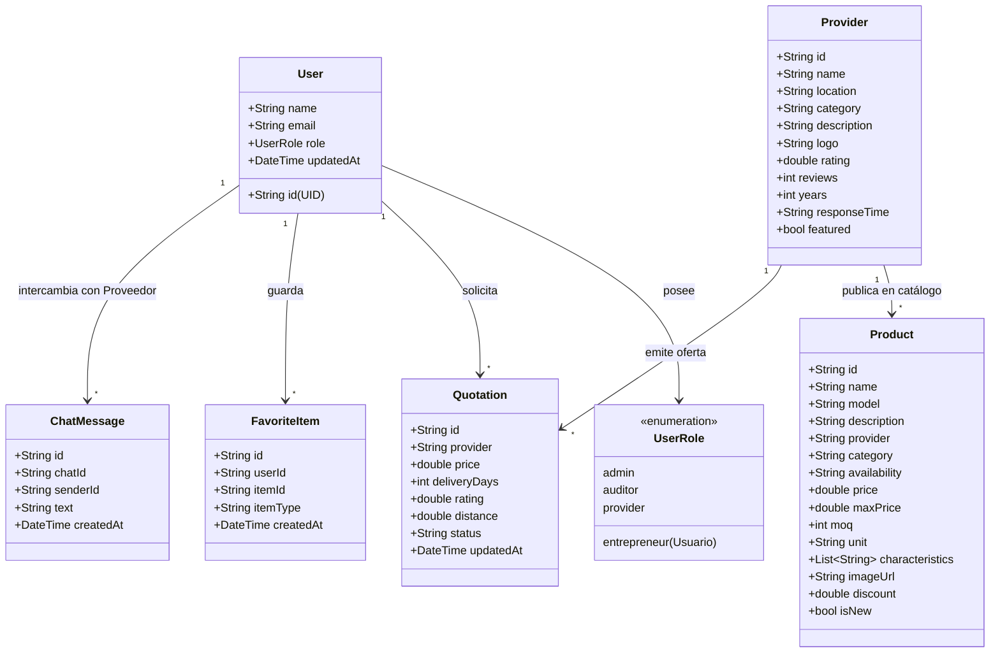

# 🚀 PROVEO Nicaragua — Plataforma Inteligente B2B

> **El puente inteligente que conecta emprendedores y empresas con los mejores proveedores verificados.**

---

## 📌 Índice de Contenidos (Criterios de Evaluación)
1. [📖 1. README Técnico y Descripción General](#-1-readme-técnico-y-descripción-general)
2. [🗄️ 2. Diagramación de Base de Datos (No Relacional / Clases)](#-2-diagramación-de-base-de-datos-no-relacional--clases)
3. [💻 3. Interfaz y Desarrollo (Formularios y Vistas)](#-3-interfaz-y-desarrollo-formularios-y-vistas)
4. [🌿 4. Control de Versiones (Git & GitHub)](#-4-control-de-versiones-git--github)
5. [🛡️ 5. Seguridad, Buenas Prácticas y Matriz de Roles (Admin, Usuario, Auditor)](#-5-seguridad-buenas-prácticas-y-matriz-de-roles-admin-usuario-auditor)
6. [▶️ 6. Ejecución de la Solución y Demo en Vivo](#-6-ejecución-de-la-solución-y-demo-en-vivo)
7. [🎨 Identidad Visual y Tipografía Oficial](#-identidad-visual-y-tipografía-oficial)

---

## 📖 1. README Técnico y Descripción General

### Descripción del Sistema
**PROVEO Nicaragua** es una plataforma digital B2B de alto impacto concebida para fortalecer el tejido productivo y comercial de Nicaragua. Permite a emprendedores, MIPYMES y compradores corporativos descubrir proveedores verificados, solicitar cotizaciones con requisitos técnicos específicos, comparar propuestas comerciales mediante algoritmos inteligentes y cerrar tratos con confianza a través de canales de mensajería integrados.

### Stack Tecnológico Oficial
- **Frontend / Cliente Multiplataforma:** Flutter 3.x (Dart SDK `>= 3.4.0 < 4.0.0`) compatible con Web (PWA), Android y Windows.
- **Identidad Tipográfica:** Google Fonts Montserrat (`google_fonts: ^8.2.1`).
- **Base de Datos en la Nube:** Google Cloud Firestore (No Relacional en tiempo real).
- **Autenticación y Seguridad:** Firebase Authentication (Email/Password, Google Sign-In, JWT) y Firebase App Check.
- **Inteligencia Artificial:** Asistente de matching y análisis B2B asistido por modelos Gemini / Genkit AI.
- **Geolocalización y Mapas:** Integración dinámica con Google Maps, Waze y coordenadas satelitales GPS.
- **Despliegue y Hosting:** Firebase Hosting con CDN global y compilación optimizada CanvasKit.

---

## 🗄️ 2. Diagramación de Base de Datos (No Relacional / Clases)

El modelo de datos está estructurado sobre **Cloud Firestore** siguiendo las mejores prácticas de bases de datos orientadas a documentos NoSQL (normalizado equivalente a 2FN para evitar redundancias críticas y optimizar lecturas rápidas):



### Colecciones Principales en Firestore (`proveodb`):
- `users/`: Perfiles registrados con rol (`admin`, `entrepreneur`, `auditor`, `provider`).
- `providers/`: Datos de empresas, calificación de confianza, tiempos de respuesta y ubicación.
- `products/`: Insumos y mercancías con MOQ, unidades de medida y fichas técnicas.
- `quotations/`: Historial de cotizaciones enviadas, montos, tiempos de entrega y estado.
- `chats/{chatId}/messages/`: Conversaciones bidireccionales en tiempo real.
- `users/{userId}/favorites/`: Marcadores de insumos y empresas preferidas.

---

## 💻 3. Interfaz y Desarrollo (Formularios y Vistas)

La solución cuenta con una arquitectura de interfaz moderna, intuitiva y 100% responsive:

1. **Pantalla de Autenticación (`AuthScreen`):**
   - Formulario validado para inicio de sesión con correo y contraseña.
   - Acceso con un clic mediante Google Sign-In.
   - Selector directo para cuentas demo de prueba y modo explorador invitado.

2. **Página de Inicio B2B (`HomeScreen`):**
   - Encabezado dinámico con barra de búsqueda rápida y navegación.
   - Hero banner corporativo con la tipografía oficial Montserrat.
   - Carrusel interactivo de marcas aliadas y métricas nacionales de impacto.

3. **Buscador con Filtros Funcionales (`SearchScreen`):**
   - Formulario de búsqueda en tiempo real por texto clave.
   - Filtros desplegables por departamento/ubicación (Managua, Masaya, etc.), categoría de industria y calificación mínima por estrellas.

4. **Perfil Empresarial del Proveedor (`ProviderProfileScreen`):**
   - Insignias de verificación oficial PROVEO.
   - Catálogo interactivo de productos con fichas técnicas expandibles.
   - Mapa de geolocalización con selector satelital y botones activos para abrir en **Google Maps**, **Waze** o copiar coordenadas GPS.

5. **Asistente de Cotización Inteligente (`MatchScreen` & `QuotationRequestScreen`):**
   - Formulario paso a paso para especificar requerimientos de volumen, plazos deseados y especificaciones técnicas.
   - Generación de recomendaciones mediante IA.

6. **Matriz de Comparación lado a lado (`ComparisonScreen`):**
   - Análisis simultáneo de alternativas considerando costo unitario, tiempos de despacho y reputación histórica.
   - Botones funcionales para Aceptar, Negociar o Descartar propuesta.

7. **Sala de Mensajería y Negociación (`ChatScreen`):**
   - Canal directo para comunicación entre compradores y proveedores con burbujas de mensaje diferenciadas y entrada de texto interactiva.

---

## 🌿 4. Control de Versiones (Git & GitHub)

El repositorio se gestiona bajo el estándar de **Conventional Commits** asegurando trazabilidad y evolución documentada del software.

- **Repositorio Oficial:** [https://github.com/OscarElieser/PROVEONICARAGUA](https://github.com/OscarElieser/PROVEONICARAGUA)
- **Ramas Principales:**
  - `main`: Rama de producción estable.
  - `backup-2026-09-05`: Rama de respaldo fechada.
- **Tags de Respaldo:** `backup-2026-09-05`

### Evidencia de Comandos Git Utilizados:
```bash
# 1. Obtener y sincronizar cambios remotos (Pull)
git pull origin main

# 2. Registrar cambios con mensajes semánticos legibles (Commit)
git add .
git commit -m "feat(typography): implementar tipografía oficial Montserrat (SemiBold 36pt, Medium 20pt, Regular 12pt) en toda la plataforma"

# 3. Publicar cambios al repositorio remoto (Push)
git push origin main
git push origin --tags
```

---

## 🛡️ 5. Seguridad, Buenas Prácticas y Matriz de Roles (Admin, Usuario, Auditor)

La plataforma aplica el principio de menor privilegio mediante **Control de Acceso Basado en Roles (RBAC)** integrado en la capa de modelos (`models.dart`), repositorios (`FirestoreRepository`) y reglas de seguridad de Firestore (`firestore.rules`).

### Matriz de Roles y Permisos:

| Permiso / Módulo | 🛡️ Administrador (`admin`) | 🧑‍💼 Usuario / Emprendedor (`entrepreneur`) | 🔍 Auditor (`auditor`) | 🏭 Proveedor (`provider`) |
| :--- | :---: | :---: | :---: | :---: |
| **Buscar y filtrar proveedores** | ✅ Lectura total | ✅ Lectura total | ✅ Lectura total | ✅ Lectura total |
| **Solicitar cotizaciones** | ✅ | ✅ | ❌ | ❌ |
| **Comparar ofertas en matriz** | ✅ | ✅ | 👁️ Solo supervisión | ❌ |
| **Gestionar catálogo y productos** | ✅ Total | ❌ | 👁️ Auditoría técnica | ✅ Solo sus productos |
| **Responder cotizaciones comerciales** | ✅ | ❌ | ❌ | ✅ |
| **Verificación de empresas e insignias** | ✅ | ❌ | ✅ Emite dictamen | ❌ |
| **Acceso a métricas del sistema** | ✅ Total | ❌ | ✅ Auditoría | 👁️ Métricas propias |
| **Reglas de seguridad en Firestore** | `request.auth.token.admin == true` | `request.auth.uid == resource.data.userId` | `request.auth.token.role == 'auditor'` | `request.auth.uid == resource.data.providerId` |

### Buenas Prácticas de Código y Arquitectura:
- **Clean Architecture:** Separación estricta entre presentación (`screens`), dominio (`models`), datos locales (`data`) e infraestructura (`services`).
- **Linter Oficial:** Reglas de calidad aplicadas según `flutter_lints: ^4.0.0`.
- **Inmutabilidad y Tipado Estricto:** Modelos con constructores `const` y serializadores seguros contra valores nulos (`null-safety`).

---

## ▶️ 6. Ejecución de la Solución y Demo en Vivo

### 🌐 Demo Pública en Vivo (Acceso Inmediato)
No requiere instalación para probar la interfaz y flujos:
- **Enlace Principal:** [https://proveonicaragua-43264.web.app](https://proveonicaragua-43264.web.app)
- **Enlace Espejo:** [https://proveonicaragua-43264.firebaseapp.com](https://proveonicaragua-43264.firebaseapp.com)

### 📹 Video de Navegación Demostrativa
- **Recorrido en Video:** Se encuentra disponible en el repositorio o en la carpeta de entrega de la solución, mostrando el flujo completo desde el inicio de sesión, búsqueda con filtros, consulta de perfil de proveedor en mapa y solicitud/comparación de cotizaciones.

### 💻 Ejecución Local en Entorno de Desarrollo

#### 1. Requisitos Previos:
- Flutter SDK `>= 3.4.0 < 4.0.0`
- Dart SDK integrado
- Google Chrome u otro navegador web moderno

#### 2. Clonar el repositorio:
```bash
git clone https://github.com/OscarElieser/PROVEONICARAGUA.git
cd PROVEONICARAGUA
```

#### 3. Instalar dependencias:
```bash
flutter pub get
```

#### 4. Ejecutar en Navegador Web:
```bash
flutter run -d chrome
```

#### 5. Ejecutar en Dispositivo Móvil / Emulador:
```bash
flutter run
```

#### 6. Comandos de Pruebas y Compilación:
```bash
# Verificación de calidad y linter
flutter analyze

# Pruebas unitarias
flutter test

# Compilación de producción
flutter build web --release
flutter build apk --release
```

---

## 🎨 Identidad Visual y Tipografía Oficial

Toda la aplicación sigue rigurosamente el manual de marca con la fuente oficial **Montserrat**:

| Nivel | Rol en PROVEO | Fuente y Peso | Tamaño | Implementación en Código |
| :--- | :--- | :--- | :--- | :--- |
| **01 — TÍTULO** | Títulos principales de portadas y secciones hero | **Montserrat SemiBold** (`FontWeight.w600`) | **36 pt** | `AppTypography.titulo` / `displayMedium` |
| **02 — SUBTÍTULO** | Bajadas explicativas y subtítulos de impacto | **Montserrat Medium** (`FontWeight.w500`) | **20 pt** | `AppTypography.subtitulo` / `titleLarge` |
| **03 — CUERPO** | Textos estándar, descripciones y párrafos | **Montserrat Regular** (`FontWeight.w400`) | **12 pt** | `AppTypography.cuerpo` / `bodyMedium` |

---

© 2026 PROVEO Nicaragua — Plataforma Privada Comercial. Todos los derechos reservados.